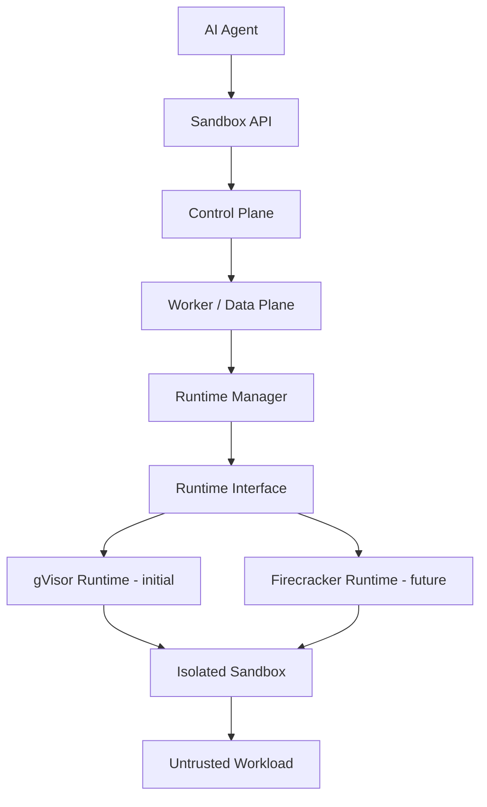

# Agenyx

> **Documentation status: TEMPLATE / TARGET ARCHITECTURE.**
> This documentation set was written from a design specification, **not** from repository inspection.
> No component, API, table, or configuration name here is confirmed to exist in code.
> Every status marked `UNVERIFIED` means: *Implementation status requires verification.*
> See [Status labels](#status-labels) and [docs/roadmap.md](docs/roadmap.md#verification-checklist).

## What Agenyx is

Agenyx is an AI-agent infrastructure platform. One subsystem is a **sandbox platform** that lets AI agents run untrusted code and tools inside isolated environments.

## Problem it solves

AI agents generate and run code, install packages, and call tools. That code is untrusted. Running it on a host or inside a trusted service exposes the host filesystem, credentials, network, and internal services. The sandbox subsystem puts a runtime isolation boundary and a policy-controlled control plane between the agent and the host.

## Core capabilities (target)

| Capability | Status |
|---|---|
| Sandbox creation, lifecycle management, destroy | PLANNED (UNVERIFIED) |
| Command and code execution | PLANNED (UNVERIFIED) |
| File read/write | PLANNED (UNVERIFIED) |
| CPU / memory / PID / disk limits, timeouts | PLANNED (UNVERIFIED) |
| Deny-by-default networking | PLANNED (UNVERIFIED) |
| Credential isolation via Credential Broker | PLANNED (UNVERIFIED) |
| Artifact handling | PLANNED (UNVERIFIED) |
| Observability | PLANNED (UNVERIFIED) |
| Failure recovery, multi-worker scheduling | PLANNED (UNVERIFIED) |
| gVisor Runtime (initial) | PLANNED (UNVERIFIED) |
| Firecracker Runtime | FUTURE |

## Architecture overview

Agenyx owns the **sandbox control plane**. gVisor and Firecracker are **low-level isolation runtimes** beneath it. Neither is the sandbox platform.

OpenSandbox and Daytona are design-research references only. They are not dependencies. See [docs/decisions.md](docs/decisions.md).

## Main components

Sandbox API, Control Plane (Sandbox Controller, Scheduler, Policy Engine, Reconciler, TTL / Lease Manager, Execution Manager), Data Plane (Worker Manager, Runtime Manager), Runtime Interface, gVisor Runtime, Firecracker Runtime, Network Enforcer, Credential Broker. Details: [docs/architecture.md](docs/architecture.md).

## Sandbox security model (summary)

- Trusted: Sandbox API, Control Plane, Worker Manager, Runtime Manager, Policy Engine, Credential Broker, databases.
- Untrusted: AI-generated code, user code, arbitrary commands and packages, any process inside a sandbox.
- Network access is deny-by-default and enabled only by explicit policy.
- No host credentials inside sandboxes.
- No claim of "escape-proof": see residual risks in [docs/security.md](docs/security.md).

## Current implementation status

**Unknown.** Run the [verification checklist](docs/roadmap.md#verification-checklist) against the repository and update the status tables in each doc.

## Development quick start

Not documented: commands have not been verified. See the placeholder procedure in [docs/development.md](docs/development.md).

## Testing

See [docs/testing.md](docs/testing.md) (existing tests are unverified; planned tests are listed).

## Documentation

| Doc | Purpose |
|---|---|
| [architecture](docs/architecture.md) | Main architecture |
| [sandbox](docs/sandbox.md) | What a sandbox is |
| [security](docs/security.md) | Threat model |
| [lifecycle](docs/lifecycle.md) | States and reconciliation |
| [runtime](docs/runtime.md) | Runtime abstraction, gVisor, Firecracker |
| [networking](docs/networking.md) | Network policy |
| [execution](docs/execution.md) | Execution model |
| [observability](docs/observability.md) | Logs, metrics, traces |
| [failure-recovery](docs/failure-recovery.md) | Failure model |
| [scaling](docs/scaling.md) | Scaling path |
| [api](docs/api.md) | Proposed API |
| [configuration](docs/configuration.md) | Configuration (to be filled) |
| [development](docs/development.md) | Dev setup |
| [testing](docs/testing.md) | Test plan |
| [operations](docs/operations.md) | Operator guide |
| [roadmap](docs/roadmap.md) | Phases |
| [decisions](docs/decisions.md) | ADRs |

## Roadmap

Seven phases from single-node gVisor sandbox to warm pools. See [docs/roadmap.md](docs/roadmap.md).

## Project status

Design stage documentation. Implementation state to be verified.

## Status labels

`IMPLEMENTED` · `PARTIALLY IMPLEMENTED` · `PLANNED` · `PROPOSED` · `FUTURE` · `UNVERIFIED` (= *Implementation status requires verification*). In this template set nothing is `IMPLEMENTED`.
